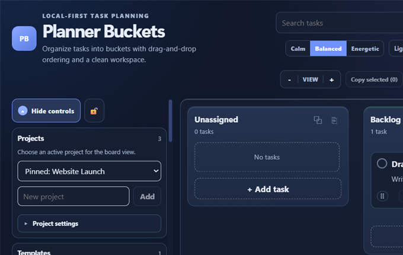
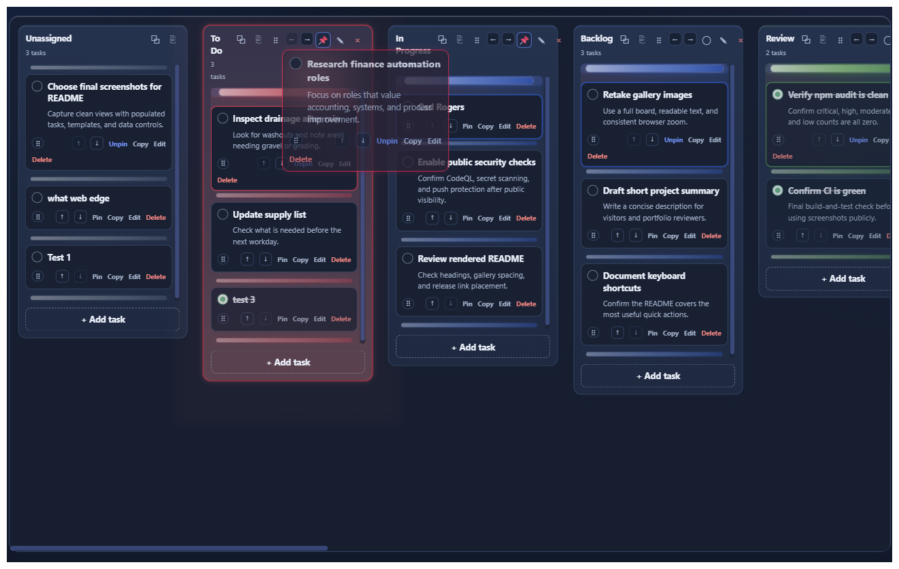
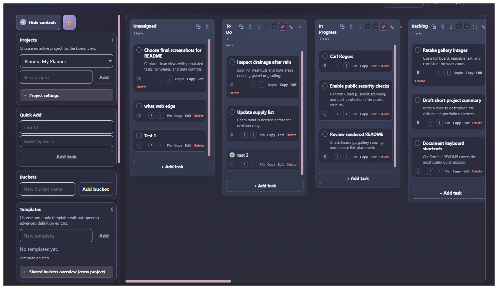
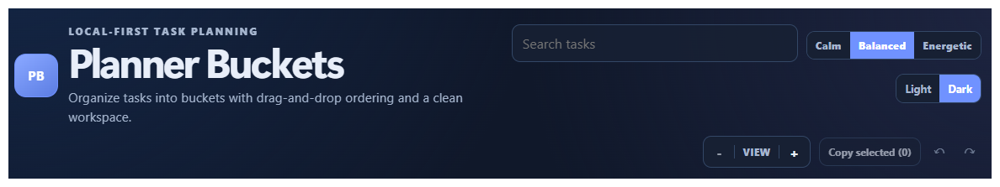
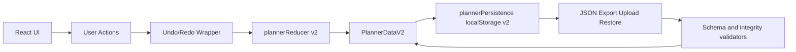

# Planner Buckets

Local-first planning board for projects, buckets, and tasks.

Planner Buckets runs fully in your browser with no backend required, while still supporting practical workflows like templates, archived-task handling, import/export, and undo/redo.

## Delivery modes

Planner Buckets is keeping the existing browser application while adding an installable Windows desktop application.

### Web application

The current supported application runs through React and Vite.

- No backend or account is required.
- Planner data is stored in browser `localStorage`.
- JSON export, upload, and restore provide data portability.
- Local development uses the commands in [Web quick start](#web-quick-start).

### Windows desktop application

The Windows desktop shell is implemented in [#39](https://github.com/Nobodyworld/planner-buckets/issues/39) alongside the browser application. It wraps the same React/Vite frontend in Tauri 2 and builds an NSIS installer.

- Its NSIS configuration targets normal current-user Windows installation and Start menu behavior.
- It keeps the existing planner schema and JSON interchange format unchanged.
- It is transitional: desktop data currently lives in that app's WebView `localStorage`.
- Durable application-data files and automatic backups are scoped to [#40](https://github.com/Nobodyworld/planner-buckets/issues/40).
- Signed updates and release publishing are scoped to [#41](https://github.com/Nobodyworld/planner-buckets/issues/41).

Continue exporting JSON backups. To migrate data from the browser, choose **Export All Data** in the browser application, then **Restore** that JSON in the desktop application. See [Desktop distribution](docs/DESKTOP.md) for prerequisites, installation, and current limitations.

## Why this exists

Most lightweight planning apps are either too minimal for real work or too dependent on cloud setup. Planner Buckets is designed for people who want:

- A fast, visual planning surface
- Durable local workflows without account friction
- Portable JSON data they can back up, audit, and move

## Privacy and local data

Planner data is stored in your browser localStorage.

- Data stays on your machine unless you explicitly export and share JSON
- Upload and restore are user-triggered actions only
- Clipboard actions copy task text only when you trigger them
- Local data is not encrypted by the app; do not store secrets, credentials, or sensitive private records in task text

If you clear site storage, local data is removed. Use Export JSON for backups.

## Gallery









## Features

Project and board management:

- Multiple projects with pinned ordering
- Bucket columns with drag-and-drop bucket reordering
- Permanent Unassigned lane for unbucketed tasks
- Pin buckets into the left group for stable triage workflows

Task workflow:

- Create, edit, delete, pin, and complete tasks
- Drag-and-drop task ordering within and across buckets
- Multi-select with Ctrl/Cmd and Shift range selection
- Copy selected tasks and paste into target buckets
- Search by task title and description

Template workflow:

- Reusable bucket templates and template definitions
- Apply templates to projects without manual bucket creation
- Shared bucket view aggregates bucket definitions across projects

Data and safety controls:

- JSON export with scoped export options
- JSON upload merge flow with identity remapping
- JSON restore with confirmation safeguards
- Undo/redo history around reducer actions

UX controls:

- Sidepanel with manual show/hide and lock behavior
- Board zoom controls with persistence
- Horizontal edge autoscroll while dragging tasks or buckets on wide boards
- Visual modes (Calm, Balanced, Energetic)
- Light and dark themes

## Web quick start

Requirements:

- Node.js 20.19+, 22.12+, or 24.x

```bash
npm install
npm run dev
```

Then open <http://localhost:5173>.

## Windows web-development start script

Use either:

- `start-local.cmd`
- `powershell -NoProfile -ExecutionPolicy Bypass -File .\scripts\start-local.ps1`

These scripts start the web development server from a local checkout. They are not desktop installers and still require the repository and Node.js.

## Testing and quality

Core checks:

```bash
npm test
npm run verify
npm run build
```

`npm run verify` is the primary pre-PR validation gate used by CI. CI runs on Node.js 20.19.0, the minimum supported Node 20 runtime.

## Desktop development and installation

The Windows shell supports Windows 10 version 1803 or later and Windows 11 when Microsoft Edge WebView2 is available. Building it requires Node.js 20.19+, 22.12+, or 24.x, Rust stable with the `x86_64-pc-windows-msvc` host, and Microsoft C++ Build Tools with **Desktop development with C++** installed.

```bash
npm run desktop:dev
npm run desktop:build
```

`npm run dev` remains the browser development command, and `npm run build` remains the browser production build. The desktop build produces an NSIS installer under `src-tauri\\target\\release\\bundle\\nsis\\`; that generated output is not committed. The current-user installer configuration is designed to add a normal Start menu entry and use standard Windows pinning and uninstall controls; verify those behaviors through a local installation test before release.

The desktop shell does not yet provide durable file storage, automatic backups, or signed updates. Keep exporting JSON backups and do not treat WebView `localStorage` as data-loss protection.

## Architecture (v2)

The app now runs on a v2 data model (`PlannerDataV2`) with explicit entities for projects, buckets, tasks, templates, and template definitions.



v2 notes:

- Migration path from v1 to v2 is built into persistence loading
- Integrity validators enforce relational consistency across projects, buckets, tasks, and template definitions
- Local storage uses versioned keys for safer recovery behavior

The desktop shell currently retains the browser persistence implementation in its WebView. A runtime-selected desktop persistence adapter with validated application-data files and backups is intentionally deferred to issue #40.

## Repository map

- `src/App.tsx`: primary composition, controls, and UI wiring
- `src/state/plannerReducerV2.ts`: deterministic state transitions
- `src/services/plannerPersistence.ts`: v1/v2 loading, migration, and browser persistence
- `src/types/v2.ts`: v2 schema contracts
- `src/types/validators.ts`: structural and relational validation rules
- `src/components/`: board and editor UI components
- `docs/DESKTOP.md`: desktop distribution, persistence, update, and validation contract

`PLAN.md` and `PLAN_V2.md` are retained as historical design records. Current source, tests, and this README are authoritative when an older plan differs from the implementation.

## Release

Current stable web showcase baseline: `1.1.0`.

Public release artifacts are managed through GitHub Releases. Windows installer artifacts will be added only after the desktop shell, durable persistence, and signed update path meet their tracked acceptance criteria.

The exact pre-desktop source baseline is preserved on `archive/web-v1.1.0-baseline-2026-07-14` at commit `61dc19147c3a82c27ecfa2796854376a409835d9`.

## License

MIT. See `LICENSE`.
