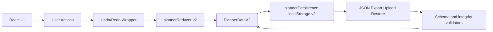

# Planner Buckets

Local-first planning board for projects, buckets, and tasks.

Planner Buckets runs fully in your browser with no backend required, while still supporting practical workflows like templates, archived-task handling, import/export, and undo/redo.

## Why this exists

Most lightweight planning apps are either too minimal for real work or too dependent on cloud setup. Planner Buckets is designed for people who want:

- A fast, visual planning surface
- Durable local workflows without account friction
- Portable JSON data they can back up, audit, and move

## Privacy and local data

Planner data is stored in your browser localStorage.

- Data stays on your machine unless you explicitly export and share JSON
- Upload and restore are user-triggered actions only
- Clipboard actions copy task text only when you trigger them
- Local data is not encrypted by the app; do not store secrets, credentials, or sensitive private records in task text

If you clear site storage, local data is removed. Use Export JSON for backups.

## Gallery


## Features

Project and board management:

- Multiple projects with pinned ordering
- Bucket columns with drag-and-drop bucket reordering
- Permanent Unassigned lane for unbucketed tasks
- Pin buckets into the left group for stable triage workflows

Task workflow:

- Create, edit, delete, pin, and complete tasks
- Drag-and-drop task ordering within and across buckets
- Multi-select with Ctrl/Cmd and Shift range selection
- Copy selected tasks and paste into target buckets
- Search by task title and description

Template workflow:

- Reusable bucket templates and template definitions
- Apply templates to projects without manual bucket creation
- Shared bucket view aggregates bucket definitions across projects

Data and safety controls:

- JSON export with scoped export options
- JSON upload merge flow with identity remapping
- JSON restore with confirmation safeguards
- Undo/redo history around reducer actions

UX controls:

- Sidepanel with manual show/hide and lock behavior
- Board zoom controls with persistence
- Horizontal edge autoscroll while dragging tasks or buckets on wide boards
- Visual modes (Calm, Balanced, Energetic)
- Light and dark themes

## Quick start

Requirements:

- Node.js 20, 22, or 24

```bash
npm install
npm run dev
```

Then open <http://localhost:5173>.

## Windows start script

Use either:

- `start-local.cmd`
- `powershell -NoProfile -ExecutionPolicy Bypass -File .\scripts\start-local.ps1`

## Testing and quality

Core checks:

```bash
npm test
npm run verify
npm run build
```

`npm run verify` is the primary pre-PR validation gate used by CI.

## Architecture (v2)

The app now runs on a v2 data model (`PlannerDataV2`) with explicit entities for projects, buckets, tasks, templates, and template definitions.



v2 notes:

- Migration path from v1 to v2 is built into persistence loading
- Integrity validators enforce relational consistency across projects, buckets, tasks, and template definitions
- Local storage uses versioned keys for safer recovery behavior

## Repository map

- `src/App.tsx`: primary composition, controls, and UI wiring
- `src/state/plannerReducerV2.ts`: deterministic state transitions
- `src/services/plannerPersistence.ts`: v1/v2 loading, migration, and persistence
- `src/types/v2.ts`: v2 schema contracts
- `src/types/validators.ts`: structural and relational validation rules
- `src/components/`: board and editor UI components

## Release

Current showcase baseline: `1.1.0`.

Public release artifacts are managed through GitHub Releases.

## License

MIT. See `LICENSE`.
