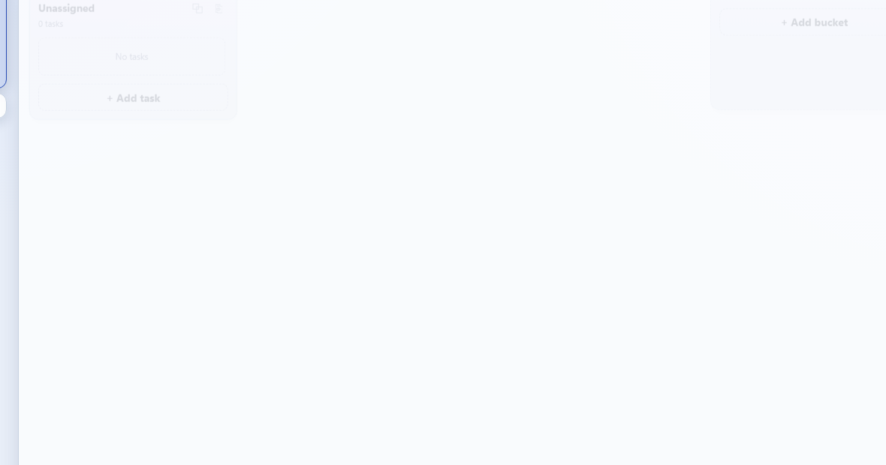
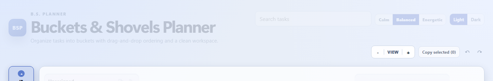
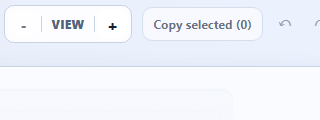
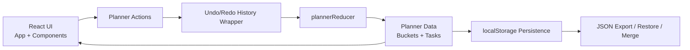

# Buckets & Shovels Planner

A local-first bucket planner built with React, TypeScript, and Vite.

Designed for fast personal planning with zero backend setup.

## License

MIT. See `LICENSE`.

## Screenshots








The gallery includes one full overview image plus focused detail views, all stored in `docs/images/`.

## Architecture



## Features

- Task create, edit, delete, and completion
- Nameable buckets
- Permanent Unassigned column
- Pin tasks to the top of a bucket and pin buckets into the left group
- Drag tasks between buckets and reorder within each bucket
- Multi-select tasks with click, Ctrl/Cmd+click, and Shift+click
- Copy selected tasks and paste them into another bucket
- Left control panel for task, bucket, and data actions, with autohide and an automatic-open lock
- Copy an individual task or copy all active tasks in a bucket as an ordered clipboard list
- Undo and redo across reducer-driven planner actions
- Search tasks by title/notes
- Toggle completed task visibility
- Archive completed tasks
- Undo archived tasks
- Board zoom, visual mode, and light/dark theme controls with persistence
- Automatic local browser storage
- JSON backup, restore, and merge upload
- Reducer unit tests

## Tech stack

- React 18 + TypeScript
- Vite 5
- Vitest for unit tests

## Quick start

Requirements: Node.js 20, 22, or 24.

```bash
npm install
npm run dev
```

Open `http://localhost:5173` (or the URL shown by Vite).

## Windows shortcut

Double-click `start-local.cmd`, or run:

```powershell
powershell -NoProfile -ExecutionPolicy Bypass -File .\scripts\start-local.ps1
```

## NPM scripts

```bash
npm run dev
npm test
npm run build
npm run preview
npm run verify
```

If dependency install fails after upgrading Node or changing registries, remove `node_modules` and `package-lock.json`, then run `npm install` again.

## Quality check before commit

```bash
npm run verify
```

On Windows, `scripts\verify.ps1` runs both checks.

## Data and privacy

The planner saves in browser `localStorage`. Clearing browser site data removes that copy, so use **Export JSON** for backups.

Use **Upload JSON** to merge a valid export into the current planner. Upload creates fresh IDs for imported items, merges buckets by matching names, and skips duplicate task title/note pairs in the target bucket. Use **Restore JSON** when you want to replace the current planner after confirmation.

Copy actions write only the selected task text or bucket task list to your system clipboard.

No data leaves your machine unless you manually export and share JSON.

## Project structure

- `src/App.tsx` — top-level composition, filters, import/export, editor state
- `src/components/` — UI pieces (`BucketColumn`, `TaskCard`, `TaskEditor`)
- `src/state/plannerReducer.ts` — deterministic planner operations
- `src/storage/plannerStorage.ts` — local persistence and import validation
- `src/types.ts` — shared domain types

## Accessibility and UX notes

- Keyboard focus styling across controls
- Labeled form and file inputs
- Modal closes on backdrop click
- Drag/drop plus button-based task actions for non-drag users
- Clipboard copy actions have text labels or descriptive button labels
- The side panel can autohide; the lock disables automatic opening without preventing manual Show/Hide

## Export and history audit notes

- Export sample files matching `bucket-planner-*.json` are ignored by `.gitignore` and are not currently tracked.
- Current tracked history is short and readable: initial release, hardening/public-readiness work, and the latest interaction polish commit.
- The sample JSON schema contains planner content only: bucket/task metadata, completion state, timestamps, and archive state.
- No credentials or environment secrets are documented in tracked repo files reviewed during this pass.

## Repository standards

- CI: GitHub Actions runs `npm run verify` on pushes and pull requests.
- Release: GitHub Actions can publish releases from `v*` tags via `.github/workflows/release.yml`.
- Line endings and whitespace: enforced by `.editorconfig` and `.gitattributes`.
- Pull request template: `.github/pull_request_template.md`.
- Issue templates: `.github/ISSUE_TEMPLATE/`.

## Main files

- `PLAN.md` — product intent and version-one boundaries
- `README.md` — setup and operational guidance
- `CHANGELOG.md` — release and change history
